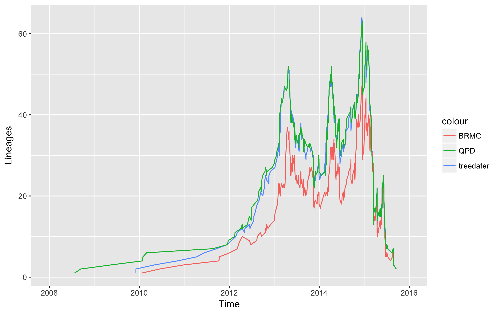

# mers-treedater
Example of using treedater on MERS-CoV data from Dudas et al. (2017).

First and foremost, many thanks to @evogytis, @trvrb and @arambaut for being such champions of reproducibility.

## Introduction

@emvolz and I have a new method (Virus Evolution, in press) on scalable relaxed clock phylogenetic dating, called [treedater](https://github.com/emvolz/treedater). This performs pretty well in comparison with BEAST for Ebola (see [here](https://github.com/sdwfrost/ebov-treedater)), getting the TMRCA as well as the timing of the peak of the epidemic very close.

@evogytis et al. have [just posted](https://github.com/blab/mers-structure) a MERS Coronavirus dataset that was used to infer the cross-species transmission of MERS-CoV from camels to humans. I thought it would be nice to give treedater a go. The R Markdown notebook is [here](https://github.com/sdwfrost/mers-treedater/blob/master/mers.Rmd).

In summary, if we take a maximum likelihood tree inferred with IQTREE, assuming an SRD06 model (like the Dudas et al. analysis), we get the following from treedater:

```r
treed <- dater(tre, tipdates, s=seqlen, maxit = 100, minblen=1./365, abstol = .001, quiet = TRUE, temporalConstraints=TRUE, numStart=2, searchRoot=10, strictClock=FALSE, ncpu=10)
```

```r
Phylogenetic tree with 274 tips and 273 internal nodes.

Tip labels:
	Jeddah-1_KF917527_camel_2013-11-08, Jeddah-1_KF958702_human_2013-11-05, Riyadh_3_2013_KF600613_human_2013-02-05, Riyadh_4_2013_KJ156952_human_2013-03-01, D1164.1_14_KX108937_camel_2014-06-02, UAE_D1164.11_2014_KP719929_camel_2014-06, ...

Rooted; includes branch lengths.

 Time of common ancestor 
2009.92606634416 

 Time to common ancestor (before most recent sample) 
5.78352269584093 

 Mean substitution rate 
0.000580268515587587 

 Strict or relaxed clock 
relaxed 

 Coefficient of variation of rates 
0.301311482042207 
```

The time of the most recent common ancestor using treedater, a Bayesian relaxed molecular clock (BMRC), and the QPD method in [lsd](https://github.com/tothuhien/lsd-0.3beta) is as follows.

- treedater  : 2009-12-05
- BEAST BMRC : 2010-01-22
- LSD QPD    : 2008-07-24

The differences between the methods become clear when you look at a plot of lineages against time (below). The difference between LSD and treedater is less extreme than for the Ebola dataset, but the root position is push back a lot further with LSD. Although the number of lineages is generally lower for BEAST, all three methods give similar timings for the peaks in lineages.


